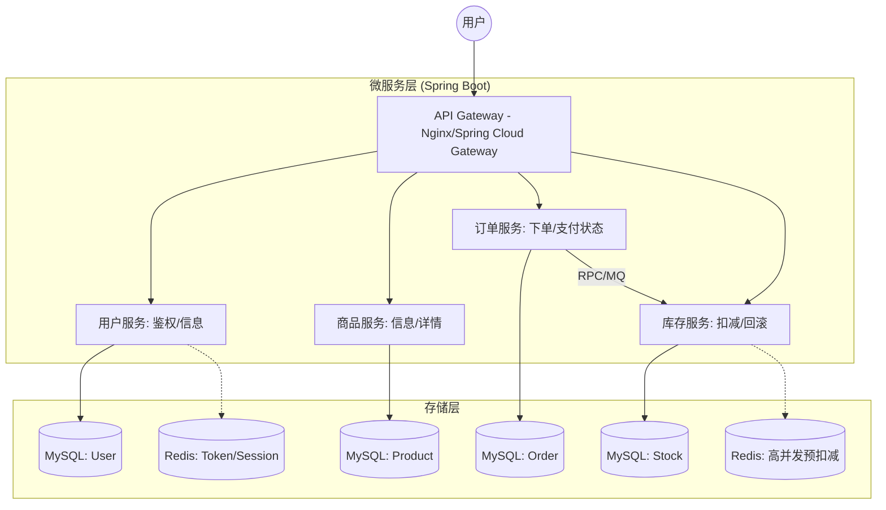
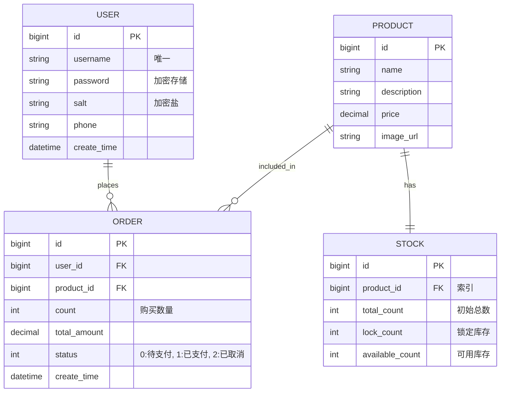

# 数据库



# 技术栈

| 选型类别     | 工具            |
| ------------ | --------------- |
| **编程语言** | Java 21         |
| **核心框架** | Spring Boot 3.5 |
| **ORM 框架** | MyBatis Plus    |
| **数据库**   | MySQL 8.0       |
| **缓存**     | Redis           |
| **鉴权**     | JWT             |
| **API 文档** | Swagger         |


# 项目框架

```markdown
 seckill-demo (根目录)
├── pom.xml (父POM，管理依赖版本)
├── mall-common (通用模块)
│   └── src/main/java/com/example/common
│       ├── result/Result.java (统一返回格式)
│       ├── util/JwtUtil.java (JWT工具类)
│       └── util/PasswordUtil.java (BCrypt加密工具)
├── mall-user (用户模块)
│   └── src/main/java/com/example/user
│       ├── entity/User.java
│       ├── mapper/UserMapper.java
│       └── service/UserService.java (实现类 UserServiceImpl)
├── mall-product (商品模块)
│   └── src/main/java/com/example/product
│       ├── entity/Product.java
│       └── mapper/ProductMapper.java
├── mall-stock (库存模块)
│   └── src/main/java/com/example/stock
│       ├── entity/Stock.java
│       ├── mapper/StockMapper.java (含扣减库存SQL)
│       └── service/StockService.java
├── mall-order (订单模块)
│   └── src/main/java/com/example/order
│       ├── entity/Order.java
│       ├── mapper/OrderMapper.java
│       └── service/OrderService.java
└── mall-api (聚合启动模块)
    ├── src/main/java/com/example/api
    │   ├── SeckillApplication.java (启动类)
    │   ├── config/WebConfig.java (配置拦截器)
    │   ├── interceptor/LoginInterceptor.java (JWT校验)
    │   └── controller/ (所有对外接口)
    │       ├── UserController.java
    │       └── OrderController.java
    └── src/main/resources
        └── application.yml (配置4个Schema数据源)
```


# API设计

| 服务         | 功能     | 方法 | 路径                       | 说明                 |
| ------------ | -------- | ---- | -------------------------- | -------------------- |
| **用户服务** | 注册     | POST | /api/v1/users/register     | 用户名、密码、手机号 |
|              | 登录     | POST | /api/v1/users/login        | 返回 JWT Token       |
| **商品服务** | 商品列表 | GET  | /api/v1/products           | 分页查询             |
|              | 商品详情 | GET  | /api/v1/products/{id}      | 获取详细描述         |
| **库存服务** | 查询库存 | GET  | /api/v1/stocks/{productId} | 查看剩余库存         |
|              | 扣减库存 | PUT  | /api/v1/stocks/deduct      | 内部调用，预扣减     |
| **订单服务** | 创建订单 | POST | /api/v1/orders             | 核心下单接口         |
|              | 订单查询 | GET  | /api/v1/orders/{id}        | 查看订单状态         |

